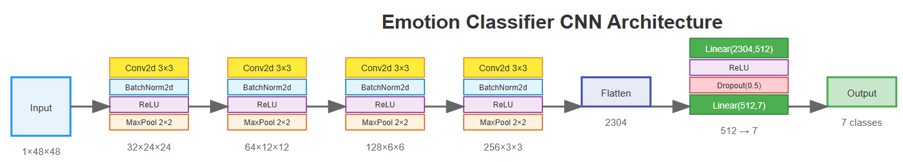
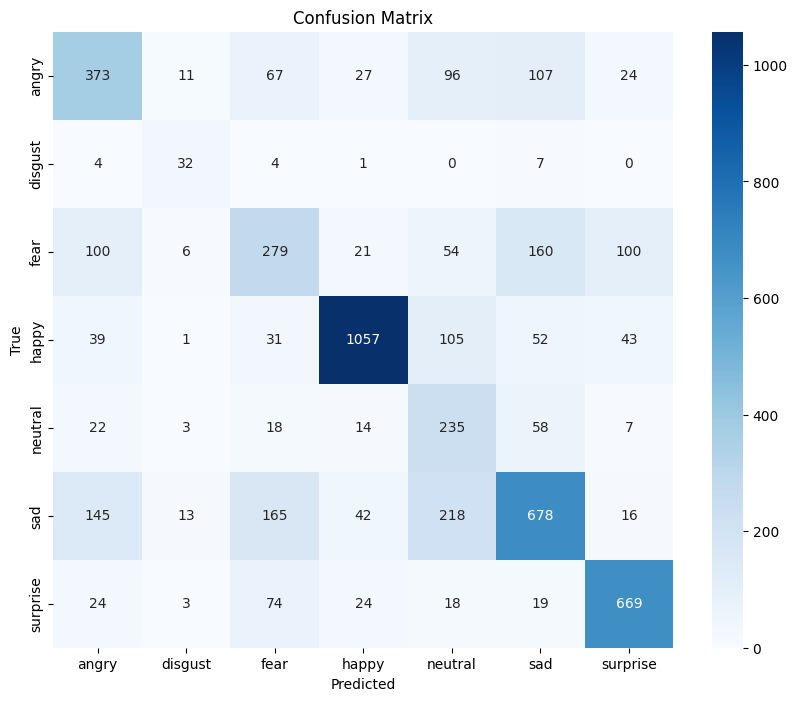
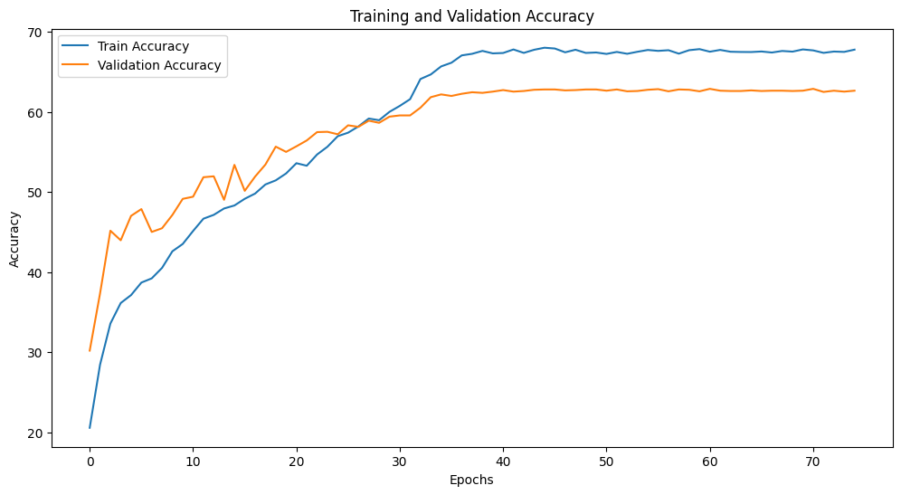

# Emotion Classifier CNN

A Convolutional Neural Network designed for facial emotion recognition, capable of classifying emotions into 7 distinct categories from 48×48 grayscale facial images.

## Architecture Overview



This is a deep CNN architecture that follows a traditional pattern of progressive feature extraction through convolutional layers, followed by classification through fully connected layers.

### Network Flow

```
Input (1×48×48) → Conv Block 1 → Conv Block 2 → Conv Block 3 → Conv Block 4 → Flatten → FC Layers → Output (7 classes)
```

## Detailed Architecture

### Convolutional Blocks

The network consists of four convolutional blocks, each following the same pattern:
- **Conv2d** with 3×3 kernel, stride=1, padding=1
- **BatchNorm2d** for training stability
- **ReLU** activation function
- **MaxPool2d** with 2×2 kernel for spatial downsampling

#### Block 1: Input Processing
- **Input**: 1×48×48 (grayscale image)
- **Conv2d**: 1 → 32 channels
- **Output**: 32×24×24

#### Block 2: Feature Extraction
- **Input**: 32×24×24
- **Conv2d**: 32 → 64 channels
- **Output**: 64×12×12

#### Block 3: Deep Feature Learning
- **Input**: 64×12×12
- **Conv2d**: 64 → 128 channels
- **Output**: 128×6×6

#### Block 4: High-Level Features
- **Input**: 128×6×6
- **Conv2d**: 128 → 256 channels
- **Output**: 256×3×3

### Fully Connected Block

After the convolutional layers, the feature maps are flattened and passed through:

1. **Flatten Layer**: 256×3×3 → 2304 dimensional vector
2. **Linear Layer 1**: 2304 → 512 neurons
3. **ReLU Activation**
4. **Dropout**: 50% dropout rate for regularization
5. **Linear Layer 2**: 512 → 7 output classes

## Parameter Count

### Convolutional Layers

| Layer | Input Channels | Output Channels | Kernel Size | Parameters |
|-------|----------------|-----------------|-------------|------------|
| Conv1 | 1 | 32 | 3×3 | (1×3×3+1)×32 = **320** |
| Conv2 | 32 | 64 | 3×3 | (32×3×3+1)×64 = **18,496** |
| Conv3 | 64 | 128 | 3×3 | (64×3×3+1)×128 = **73,856** |
| Conv4 | 128 | 256 | 3×3 | (128×3×3+1)×256 = **295,168** |

### Batch Normalization Layers

| Layer | Channels | Parameters |
|-------|----------|------------|
| BN1 | 32 | 32×2 = **64** |
| BN2 | 64 | 64×2 = **128** |
| BN3 | 128 | 128×2 = **256** |
| BN4 | 256 | 256×2 = **512** |

### Fully Connected Layers

| Layer | Input Size | Output Size | Parameters |
|-------|------------|-------------|------------|
| FC1 | 2304 | 512 | (2304+1)×512 = **1,180,160** |
| FC2 | 512 | 7 | (512+1)×7 = **3,591** |

### Total Parameters

| Component | Parameters |
|-----------|------------|
| Convolutional Layers | 387,840 |
| Batch Normalization | 960 |
| Fully Connected Layers | 1,183,751 |
| **TOTAL** | **1,572,551** |

## Key Features

- **Progressive Channel Expansion**: 1 → 32 → 64 → 128 → 256 channels
- **Spatial Dimension Reduction**: 48×48 → 24×24 → 12×12 → 6×6 → 3×3
- **Regularization**: Batch normalization and dropout (0.5) to prevent overfitting
- **Efficient Design**: Uses 3×3 convolutions with padding to maintain spatial information
- **Hierarchical Learning**: Each layer learns increasingly complex features

## Input/Output Specifications

- **Input**: Single-channel (grayscale) images of size 48×48 pixels is must
- **Output**: 7-dimensional vector representing emotion class probabilities
- **Expected Classes**: Typically anger, disgust, fear, happiness, sadness, surprise, and neutral

## Usage

```python
import torch
import torch.nn
import torch.nn.functional as F

# first, define the model class (same as in the code)
class EmotionClassifier(nn.Module):
    def __init__(self, num_classes=7):
        super(EmotionClassifier, self).__init__()
        # ... (model definition as shown in architecture, code file)

# setup device
device = torch.device("cuda" if torch.cuda.is_available() else "cpu")

# load the model file:
model.load_state_dict(torch.load('Emotion_Detection_CNN_Model_more_filters.pth', map_location=device))

# use the model
model.eval()  # Set to evaluation mode

# Example
with torch.no_grad():
    input_tensor = torch.randn(1, 1, 48, 48).to(device)  # I'm using random 48*48 pixels, use real 48*48 image here (Batch size 1)
    output = model(input_tensor)
    probabilities = F.softmax(output, dim=1)
    predicted_class = torch.argmax(probabilities, dim=1)
    
    print(f"Output logits shape: {output.shape}")  # torch.Size([1, 7])
    print(f"Predicted class: {predicted_class.item()}")
    print(f"Class probabilities: {probabilities.squeeze().cpu().numpy()}")

# -------------------------------------------------------
# For real image processing:
import cv2
import numpy as np
from PIL import Image

def preprocess_image(image_path):
    """Preprocess image for emotion classification"""
    # Load and convert to grayscale
    img = cv2.imread(image_path, cv2.IMREAD_GRAYSCALE)
    # Resize to 48x48
    img = cv2.resize(img, (48, 48))
    # Normalize to [0, 1]
    img = img.astype(np.float32) / 255.0
    # Convert to tensor and add batch dimension
    img_tensor = torch.from_numpy(img).unsqueeze(0).unsqueeze(0)
    return img_tensor

# Load and classify a real image
image_path = 'path/to/your/face_image.jpg'
input_image = preprocess_image(image_path).to(device)

with torch.no_grad():
    output = model(input_image)
    probabilities = F.softmax(output, dim=1)
    predicted_emotion = torch.argmax(probabilities, dim=1).item()
    
    emotion_labels = ['Angry', 'Disgust', 'Fear', 'Happy', 'Sad', 'Surprise', 'Neutral']
    print(f"Predicted emotion: {emotion_labels[predicted_emotion]}")
    print(f"Confidence: {probabilities[0][predicted_emotion].item():.4f}")
```

## Model Complexity

The model has approximately **1.57 million parameters**, making it a moderately-sized CNN suitable for:
- Training on limited computational resources
- Real-time inference applications
- Transfer learning scenarios
- Educational purposes for understanding CNN architectures

The architecture strikes a balance between model capacity and computational efficiency, making it well-suited for facial emotion recognition tasks.

## `NOTE: To decrease training time, we can implement plateau or fall detection in the training loop and freezing the weights till that particular epoch, halting the training process.So, now we only run the epochs if there's a constant improvement in model performance on validation data.`

## Training Loop:

```
Starting training...
Epoch [1/75], 
Train Loss: 1.9450, Train Accuracy: 20.55%, 
Val Loss: 1.8011, Val Accuracy: 30.18%


Epoch [2/75], 
Train Loss: 1.8027, Train Accuracy: 28.43%, 
Val Loss: 1.6710, Val Accuracy: 37.32%


Epoch [3/75], 
Train Loss: 1.7292, Train Accuracy: 33.56%, 
Val Loss: 1.5756, Val Accuracy: 45.16%


Epoch [4/75], 
Train Loss: 1.6734, Train Accuracy: 36.13%, 
Val Loss: 1.5319, Val Accuracy: 43.96%


Epoch [5/75], 
Train Loss: 1.6448, Train Accuracy: 37.12%, 
Val Loss: 1.4464, Val Accuracy: 47.01%
...

**In final epoch**
Val Loss: 1.1461, Val Accuracy: 62.64%
```
## Per Class Test accuracy:

```
Test Accuracy: 63.10%

--- Per-Class Accuracy ---
Accuracy of angry     : 52.91 %
Accuracy of disgust   : 66.67 %
Accuracy of fear      : 38.75 %
Accuracy of happy     : 79.59 %
Accuracy of neutral   : 65.83 %
Accuracy of sad       : 53.09 %
Accuracy of surprise  : 80.51 %


--- Classification Report ---
              precision    recall  f1-score   support

       angry       0.53      0.53      0.53       705
     disgust       0.46      0.67      0.55        48
        fear       0.44      0.39      0.41       720
       happy       0.89      0.80      0.84      1328
     neutral       0.32      0.66      0.43       357
         sad       0.63      0.53      0.58      1277
    surprise       0.78      0.81      0.79       831

    accuracy                           0.63      5266
   macro avg       0.58      0.62      0.59      5266
weighted avg       0.66      0.63      0.64      5266
```



## Train vs Test (for full 75 epochs)


